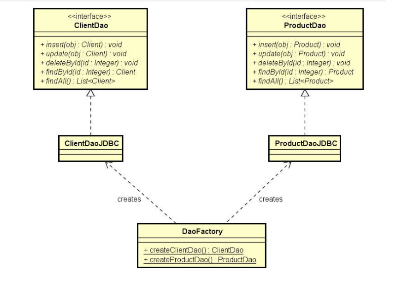

# demo-DAO-JDBC

- Nesse projeto é realizada uma camada de acesso a dados de um pequeno sistema de vendedores e departamentos.
Acesso ao banco de dados com JDBC usando o banco de dados MySql


## O que é JDBC?
- É a sigla para Java DataBase Connectivity, que é uma API padrão do java para acesso a dados.
- Em outras palavras, é uma biblioteca pedrão que já vem com o java para acessarmos algum banco de dados.
- O JDBC está no pacote java.sql e também no javax.sql (este ultimo é uma API suplementar para servidores)
- Explicação pessoal: Em nossa aplicação java, o JDBC vai nos permitir programar o acesso a dados de um forma unica para todos os bancos de dados relacionais. E no momento que esse acesso ao banco de dados, que nós criamos, for realizado, o proprio JDBC vai escolher a forma aproproiada dado o banco de dados que queremos acessar(JDBC vai converter o que nós escrevemos para a linguagem nativa daquele banco de dados em questão).  "Nos permite escrever apenas uma vez, e rodar em "todos" bancos de dados relacionais, pois é o JDBC quem vai converter o que nós escrevemos para a linguagem nativa daquele banco de dados em questão".
- O JDBC precisa do connector do banco de dados em questão para poder se comunicar com ele. Caso não estejamos usando um Gerenciador de dependencias, devemos baixar esse connector como uma biblioteca externa do java.
- Nesse exemplo, foi:
  - Criado um file chamado db.properties contendo os dados de conexão com o banco de dados.
  - Criada uma classe chamada DB e apartir dessa classe nós iremos implementar a conexões/desconexão com o banco de dados (usando os dados informado no file db.properties).
```json
    public class DB {

    public static Connection conn = null;

    public static Connection getConnection() {
        if(conn == null) {
            try {
                Properties props = loadProperties();
                String url = props.getProperty("dburl");
                conn = DriverManager.getConnection(url, props);
            } catch (SQLException e){
                throw new DbException(e.getMessage());
            }
        }
        return conn;
    }

    public static void closeConnection() {
        if(conn != null) {
            try {
                conn.close();
            } catch (SQLException e) {
                throw new DbException(e.getMessage());
            }
        }
    }

    public static Properties loadProperties() {
        try (FileInputStream fs = new FileInputStream("db.properties")) {
            Properties props = new Properties();
            props.load(fs);
            return props;
        } catch (IOException e) {
            throw new DbException(e.getMessage());
        }
    }
```
  - Da nossa API do JDBC, nós vemos usar 3 classes com bastante frequencia:
    - Statement
    - PreparadStatement
    - ResultSet


## O que é DAO?
  - padrão de projetos DAO(Data Access Object)
  - Em resumo, da para dizer que a o padrão DAO define que cada entidade do nosso projeto, tera um objeto responsável por fazer o acesso aos dados relacionados a essa entidade.
    - Por exemplo:
    - Para a nossa entidade Cliente, havera um objeto ClienteDao responsavel por fazer os acessos aos dados referente a clientes
    - Para a nossa entidade Produto, havera um objeto ProdutoDao responsavel por fazer os acessos aos dados referente a Produto
    - Para a nossa entidade Pedido, havera um objeto PedidoDao responsavel por fazer os acessos aos dados referente a Pedido
  - Cada DAO é representado por uma interface.
    -Pq interface? porque o nosso modo de acesso a dados pode mudar posteriormente ou mudar de banco de dados.
    -Devido ao usado de uma interface, devemos definir como será nossa injeção de dependência. Nesse exercício, a injeção de dependência foi feita por meio do padrão de projeto Factory.
  A interface ClienteDAO ira definir os metodos/operações que podem ser realizadas com os dados da nossa entidade Cliente, e ai nós teremos outra classe que ira implementar essa interface e implementar todas as operações dessa interface. O mesmo vale para as outras entidades do nosso projeto.



